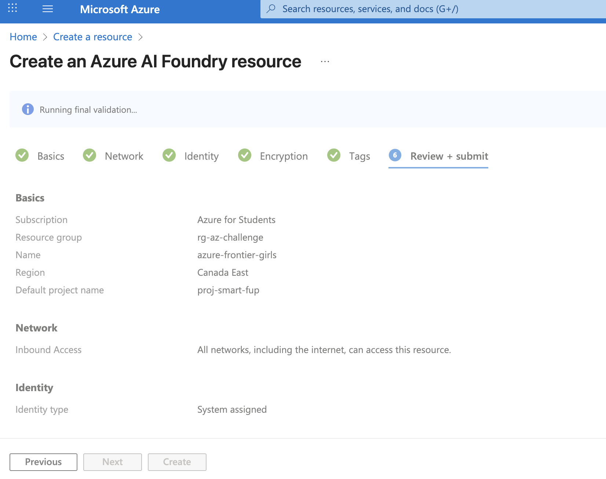
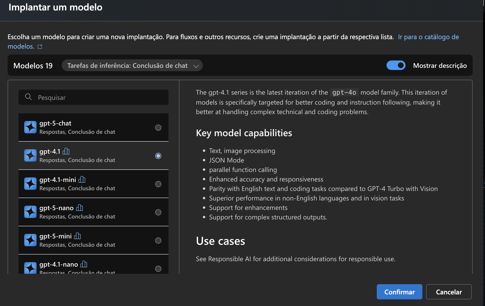
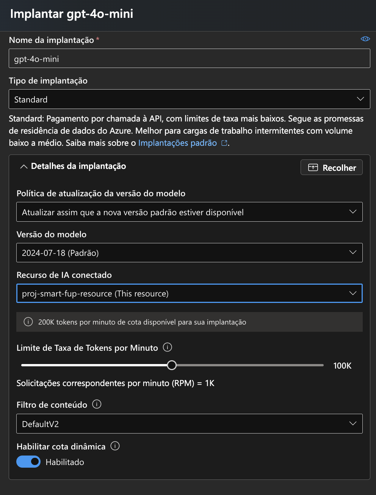
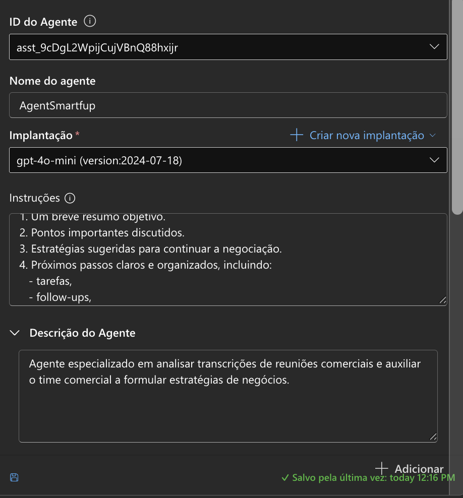
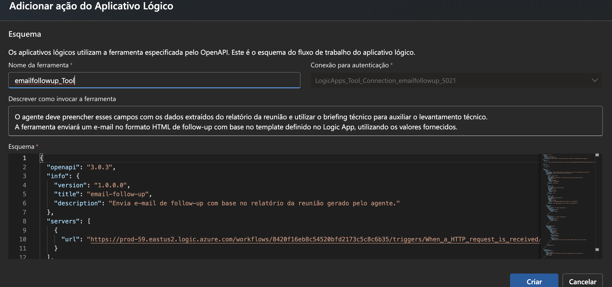
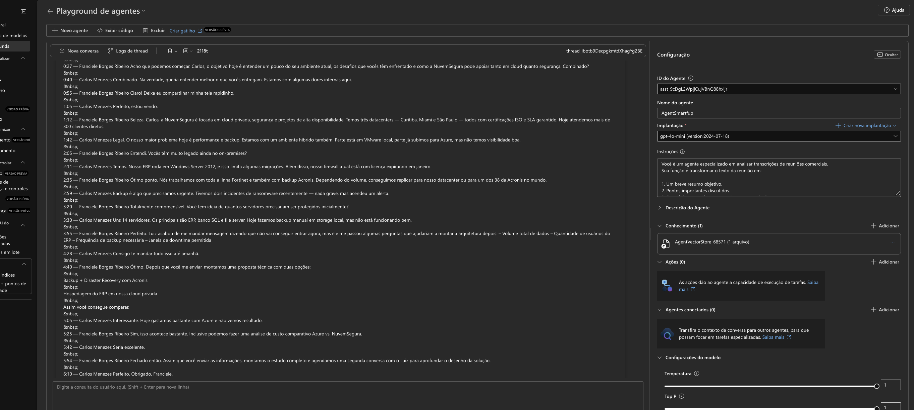
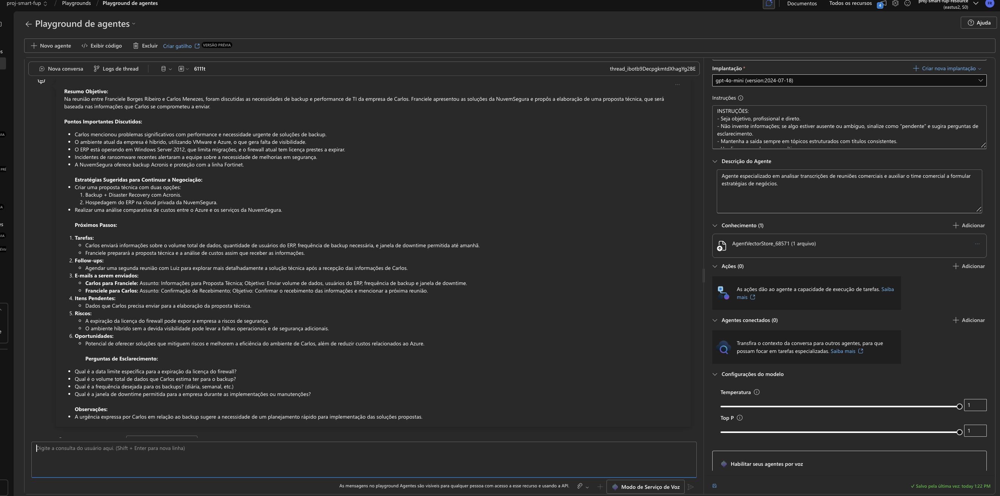
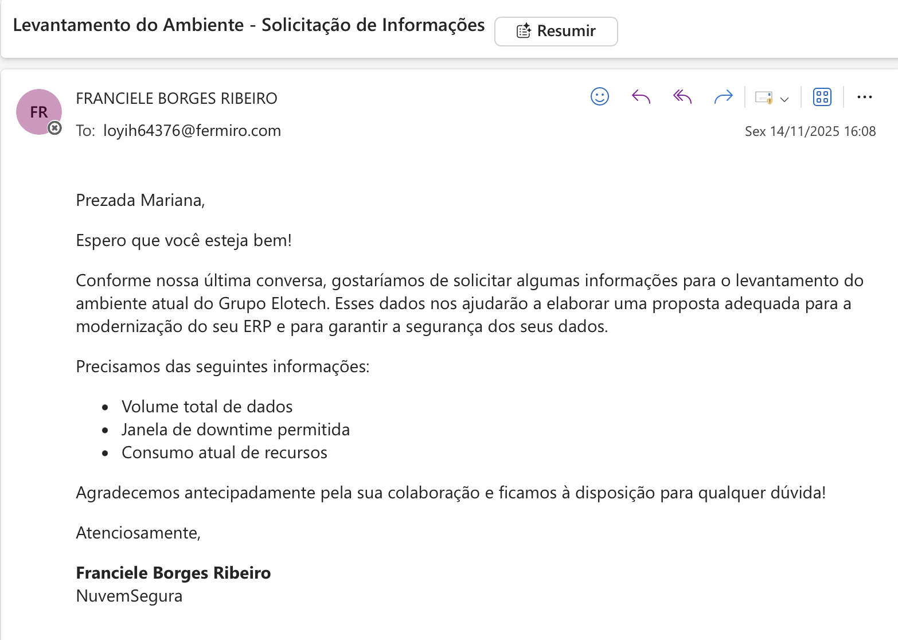
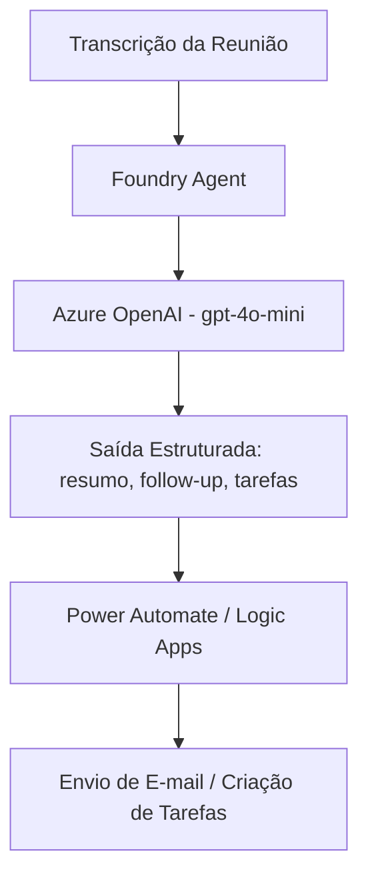

# 🚀 Como Criar e Executar o Agente

Abaixo está o passo a passo completo, com as imagens do projeto.

## 1️⃣ Criar o Recurso Azure OpenAI

- Acesse o **Azure Portal**  
- Crie o recurso **Azure OpenAI**  
- Defina nome, grupo de recursos e região permitida  

📷 *Imagem:*  

---

## 2️⃣ Deploy do Modelo (GPT-4o-mini)

- Abra o recurso Azure OpenAI  
- Vá em **Deployments**  
- Faça o deploy do modelo **gpt-4o-mini**  

📷 *Imagem:*  

---

## 3️⃣ Criar o Agente no Foundry

- Acesse o Foundry  
- Clique em **Create Agent**  
- Configure:
  - Nome: Smart_FUP-AI  
  - Descrição  
  - Objetivo  
  - Chave/API do Azure OpenAI  

📷 *Imagem:*  

---

## 4️⃣ Configurar o Prompt Principal

O prompt define o comportamento do agente:

- Interpreta a transcrição  
- Extrai tópicos essenciais  
- Gera follow-up  
- Estrutura tarefas  
- Sugere e-mail automático  

📷 *Imagem:*  

---

## 5️⃣ Criar Automação no Logic Apps

Aqui criamos o fluxo responsável por:

- Receber a saída do agente  
- Disparar:
  - E-mail de follow-up  
  - Criação de tarefas (opcional)

📷 *Imagem:*  

---

## 6️⃣ Testar o Agente

Após inserir uma transcrição real ou simulada, validamos:

- Resumo  
- Pontos principais  
- Follow-up  
- Tarefas  
- Corpo do e-mail sugerido  

📷 *Exemplos de entrada:*  

📷 **Exemplos de saída:* 
1. 
 
2.   

---

## 🔄 Fluxo da Solução

## 📊 Estrutura de Output Produzido

O agente organiza o resultado nos seguintes blocos:

1. Resumo da Reunião
    Contexto e síntese geral.

2. Pontos-Chave
    Tópicos discutidos e decisões.

3. Oportunidades
    Dores, necessidades e possibilidades de negócio.

4. Follow-Up Estratégico
    Passos recomendados com base na conversa.

5. Sugestão de E-mail
    Texto automático para envio ao cliente.

6. Tarefas
    Lista objetiva do que precisa ser feito.

📁 Exemplos → [examples/](./examples/)

## ✅ Conclusão

Com este fluxo configurado, o agente **Smart_FUP-AI** está pronto para transformar transcrições de reuniões comerciais em relatórios estruturados e e-mails de follow-up automáticos.  
A documentação acima garante que qualquer pessoa consiga replicar o processo no **Azure OpenAI + Foundry + Logic Apps**.
